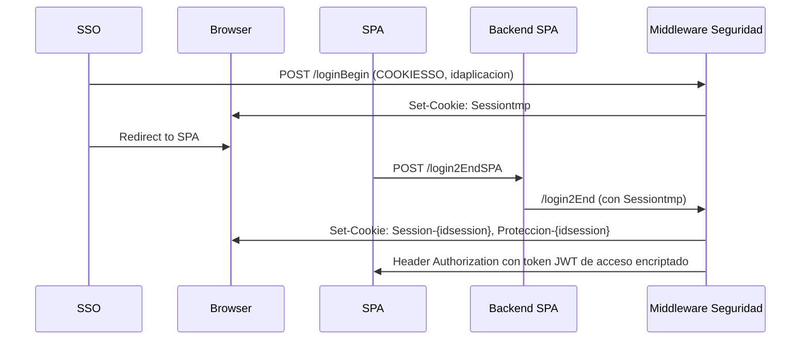

# 🛡️ Objetivo de Construcción - POC Seguridad (Opción 2)

> **Objetivo**: Implementar autenticación segura basada en token JWT en almacenamiento local con cookie de protección, conforme a los requerimientos de las buenas prácticas (opción 2).

---

## 📌 Común a la Opción 1 y 2

### Cookies
- Atributos: `Secure`, `HttpOnly`, `SameSite=Strict`, `Path=/`, `Domain=.tudominio.es`.
- Cookies encriptadas con `AES/CBC/PKCS5Padding`.
- Nombradas por sesión: `Session-{idsession}`, `Acceso-{idsession}` o `Proteccion-{idsession}`.
- Se comportan por navegador (no por pestaña), por eso se guarda `idsession` en `sessionStorage`.

### Tokens
- JWT firmados (idealmente con certificado propio).
- Claims obligatorios: `aud`, `sub`, `iss`, `exp`, `jti`, `typ`, `idsession`.
- Claims personalizados según tipo: sesión, acceso, refresco.
- Encriptación si no están dentro de cookie segura.

### Seguridad adicional
- Configurar correctamente **CORS** y cabecera `X-Token-Pro=1`.
- Evitar XSS mediante Angular y almacenamiento seguro.
- Validaciones estrictas de cabeceras, claims y firma JWT.
- El middleware actúa como servicio REST, interno, con MTLS y validación de certificado `X-Cert-Auth`.

---

## 📐 Flujo General - Opción 2

---

## 🧱 Pasos para Construir la POC (Opción 2)

### 1. Endpoint `/loginBegin`
*(Idéntico al de la opción 1, genera cookie temporal `Sessiontmp`)*

---

### 2. Endpoint `/login2End`
- **Quién llama**: Backend SPA
- **Parámetros**: Cookie `Sessiontmp`, Header `X-Cert-Auth`
- **Respuesta**:
  - Cookies: `Session-{idsession}`, `Proteccion-{idsession}`
  - Header: `Authorization` con token JWT de acceso encriptado
  - Header: `X-Idsession`
- **Acciones**:
  - Leer y validar JWT de `Sessiontmp`
  - Generar tokens de sesión y refresco
  - Crear fingerprint y calcular hash
  - Incluir `hashFingerprint` en claim del token de acceso
  - Encriptar y devolver: cookie `Proteccion-{idsession}` y header `Authorization`

---

### 3. Endpoint `/refresco2`
- **Quién llama**: Backend SPA
- **Parámetros**:
  - Cookies: `Session-{idsession}`, `Proteccion-{idsession}`
  - Header: `X-Idsession`, `X-Cert-Auth`
  - Header: `Authorization` con token de acceso actual
- **Respuesta**:
  - Header: `Authorization` nuevo
  - Cookie: `Proteccion-{idsession}` (si se regenera)
- **Acciones**:
  - Validar tokens
  - Verificar fingerprint
  - Comprobar `NumeroRefresco < MaxRefrescos`
  - Generar nuevo token de acceso con `NumeroRefresco++`
  - Encriptar y devolver

---

### 4. Endpoint `/logoff2`
- **Quién llama**: Backend SPA
- **Parámetros**:
  - Cookies: `Session-{idsession}`, `Proteccion-{idsession}`
  - Header: `X-Idsession`, `X-Cert-Auth`, `Authorization`
- **Respuesta**:
  - Borrar cookies y header `Authorization`

---

### 5. Endpoint `/obtenerclaims2`
- **Quién llama**: Backend SPA
- **Parámetros**:
  - Cookies: `Session-{idsession}`, `Proteccion-{idsession}`
  - Header: `X-Idsession`, `X-Cert-Auth`, `Authorization`
- **Respuesta**:
  - Body: claims de sesión, refresco, acceso

---

## ⚙️ Frontend Angular

- Almacena `idsession` en `sessionStorage`.
- Guarda `Authorization` en memoria o en `sessionStorage`.
- Al hacer peticiones REST:
  - Agregar `Authorization: {token}`
  - Enviar cabecera `X-Token-Pro: 1`
  - Usar `withCredentials: true` para enviar cookies automáticamente.

---

## ⚙️ Backend SPA

- Validar `Authorization` desencriptando el token.
- Verificar `hash(fingerprint) === claim del token`.
- Si token expirado: llamar `/refresco2`.
- Controlar el acceso según claims del token de acceso.

---
