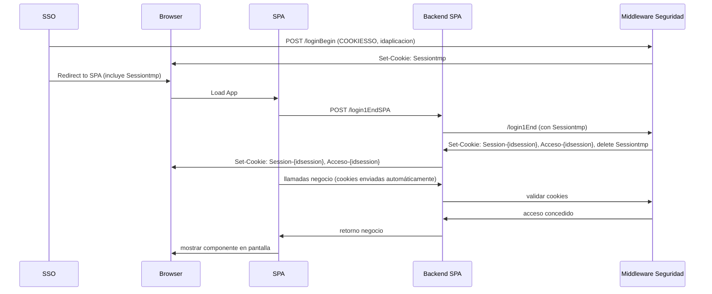

# 🛡️ Instrucciones de Construcción - POC Seguridad (Opción 1)

> **Objetivo**: Implementar la autenticación segura mediante cookies con tokens JWT, siguiendo los requerimientos de buenas prácticas para aplicaciones SPA con backend REST.

---

## 🔖 Requisitos de la POC

1. **SSO** basado en una cookie `COOKIESSO` no segura, con autenticación MTLS contra LDAP.
2. **SPA Angular** servida desde `spa.tudominio.es`.
3. **Backend** desplegado en `aplicaciones.tudominio.es`, mismo dominio raíz (`*.tudominio.es`).
4. **Tokens JWT** en cookies seguras: sesión, refresco y acceso.
5. **Cookies encriptadas** (`AES/CBC/PKCS5Padding`) y con atributos:
   ```
   HttpOnly; Secure; SameSite=Strict; Domain=.tudominio.es; Path=/
   ```
6. Implementación **sin estado** (stateless): no se almacena sesión en backend, solo validación JWT.
7. **Cabecera de protección `X-Token-Pro = 1`** y configuración **CORS** adecuada.

---

## 📐 Estructura General del Flujo



---

## 🧱 Pasos para Construir la POC (Opción 1)

### 1. Endpoint `/loginBegin`
- **Quién llama**: Backend SSO
- **Parámetros**: `idaplicacion`, `Cookie: COOKIESSO`, `X-Cert-Auth`
- **Respuesta**: `Set-Cookie: Sessiontmp`
- **Acciones**:
  - Leer `COOKIESSO`, extraer `idusuario`
  - Crear token JWT de sesión temporal
  - Encriptar y devolver como cookie `Sessiontmp`

### 2. Endpoint `/login1End`
- **Quién llama**: Backend SPA
- **Parámetros**: Cookie `Sessiontmp`, Header `X-Cert-Auth`
- **Respuesta**: Cookies `Session-{idsession}`, `Acceso-{idsession}`, Header `X-Idsession`
- **Acciones**:
  - Validar JWT de `Sessiontmp`
  - Generar y validar tokens de sesión, refresco y acceso
  - Encriptar y devolver como cookies seguras

### 3. Endpoint `/refresco1`
- **Quién llama**: Backend SPA
- **Parámetros**: Cookies `Session-{idsession}`, `Acceso-{idsession}`, Header `X-Idsession`, `X-Cert-Auth`
- **Respuesta**: `Set-Cookie: Acceso-{idsession}`
- **Acciones**:
  - Validar tokens
  - Regenerar token de acceso con `NumeroRefresco++`

### 4. Endpoint `/logoff1`
- **Quién llama**: Backend SPA
- **Parámetros**: Cookies `Session-{idsession}`, `Acceso-{idsession}`, Header `X-Idsession`, `X-Cert-Auth`
- **Respuesta**: Borrar cookies, Header `X-Idsession` vacío

### 5. Endpoint `/obtenerclaims1`
- **Quién llama**: Backend SPA
- **Parámetros**: Cookies `Session-{idsession}`, `Acceso-{idsession}`, Header `X-Idsession`, `X-Cert-Auth`
- **Respuesta**: Claims de los 3 tokens

### 6. Endpoint `/estadosession`
- **Quién llama**: Backend SPA
- **Parámetros**: Cookie `Session-{idsession}`, Header `X-Idsession`, `X-Cert-Auth`
- **Respuesta**: Código HTTP con estado

---

## 🧩 Configuración Angular (frontend)

```ts
{ withCredentials: true, headers: { 'X-Token-Pro': '1' } }
```

- No leer las cookies directamente.
- Las cookies se enviarán automáticamente si cumplen las políticas.

---

## 🧩 Configuración Backend (SPA)

- Validar token de acceso en cada petición.
- Extraer token de cookie `Acceso-{idsession}`.
- Si expirado: llamar a `/refresco1`.
- Aplicar control de acceso según claims.

---
